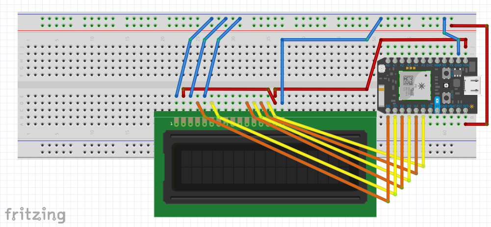
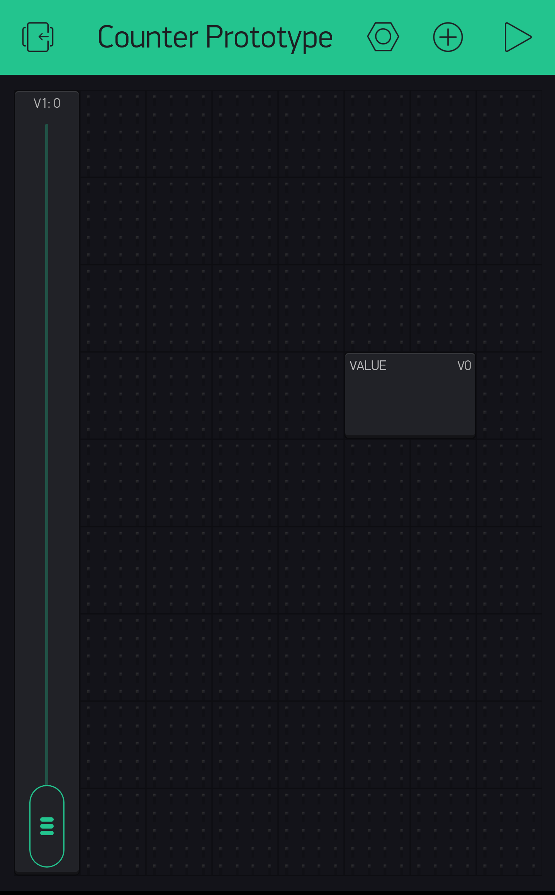
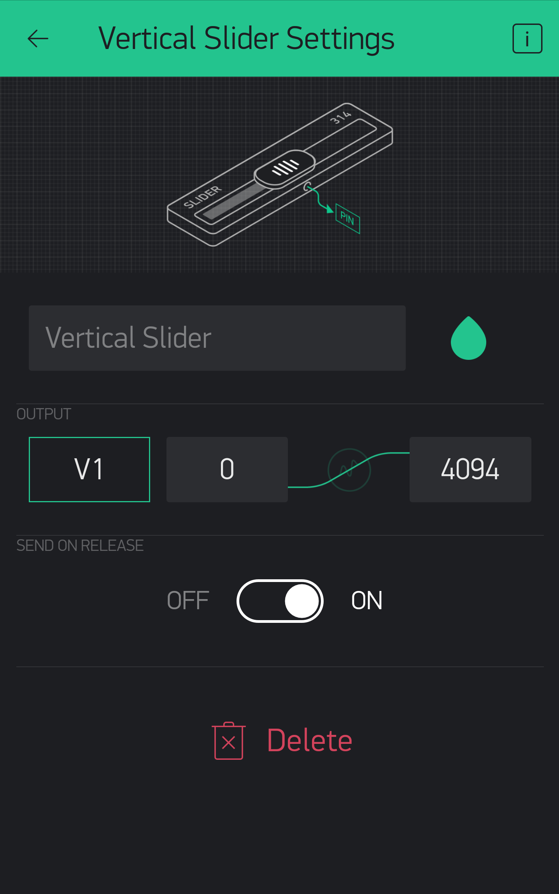
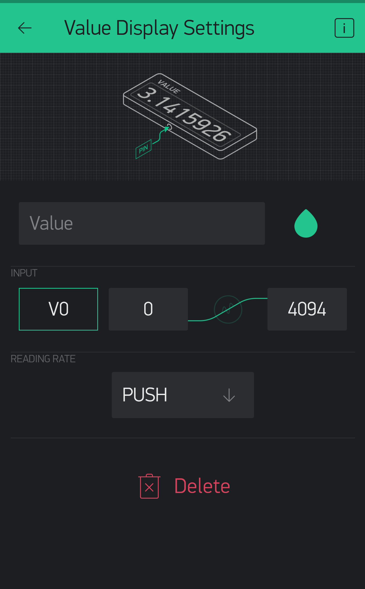

# counter-prototype

Very similar to the [blynk-ohm-meter](https://github.com/technopig/Blynk-Ohm-Meter) project. This project's key differences include:
- No more physical resistors on the board. They are not necessary because the Blynk slider is used to simulate the rail resistances.
- Instead of displaying resistance or raw value, this project is intended to bin resistances and display an `int` 0 through 30.

The goal of this project is to make a slider in Blynk which controls the LCD display to display integers 0-30, with 0 being mapped to the slider at full and 30 being mapped to the slider at empty. For the purposes of this project, the Blynk app slider will range from 0-4094.

## Wiring Setup

## Blynk app

