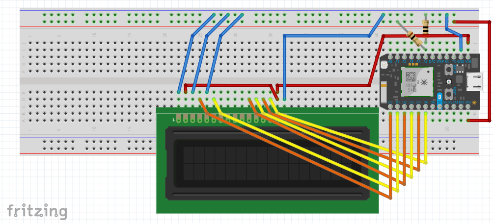

# counter-prototype

Very similar to the [blynk-ohm-meter](https://github.com/technopig/Blynk-Ohm-Meter) project. This project's key differences include:
- No more physical resistors on the board. They are not necessary because the Blynk slider is used to simulate the rail resistances.
- Instead of displaying resistance or raw value, this project is intended to bin resistances and display an `int` 0 through `FULL_MAG` - the capacity of the mag.

The goal of this project is to make a slider in Blynk which controls the LCD display to display integers 0-`FULL_MAG`, with 0 being mapped to the slider at full and 30 being mapped to the slider at empty. For the purposes of this project, the Blynk app slider will range from `LOW_MAP` to `HIGH_MAP`. The purpose of allowing variable mapping is to optimize the analogRead range in the mostly linear zone. Suggested values are `LOW_MAP=1500` and `HIGH_MAP=2500`

It also outputs the `analogRead` values from `A5`.

## Wiring Setup

The 10 ohm known resistor from `GND` to `A5`.

**NOTE:** 10 ohms is too small - it gets hella hot. Quick math says it will have about 300mA going through it.

Connect the unknown resistor from `3.3V` to `A5`.

## Blynk app

